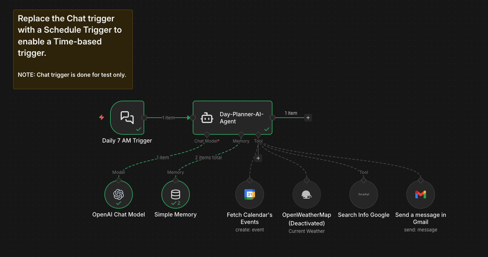

# n8n Daily Planner AI Agent Workflow

## Overview

This n8n workflow creates an **AI-powered daily scheduler** that runs automatically at 7 AM every day. It fetches your Google Calendar events for today, generates a friendly mobile-optimized summary using GPT, and sends it to you via both **Gmail** and **Telegram** (Gmail tool configured, Telegram requires additional setup).

**Key Features:**
- Automatic daily execution at 7 AM
- Fetches real calendar events for current day
- AI-generated friendly summary with bullet-point schedule
- Handles empty days ("You have a free day!")
- Mobile-friendly formatting
- Extensible with weather/news tools

**GitHub Repository:** [https://github.com/AnubhavKarki/day-planner-agent.git](https://github.com/AnubhavKarki/day-planner-agent.git)

## Workflow Architecture

```
Daily Trigger → AI Agent → [Calendar + Gmail + Search Tools] → Sends Summary
```

The central **Day-Planner-AI-Agent** receives all tools and a detailed system prompt that enforces consistent output formatting.

## Node Breakdown

### 1. **Daily 7 AM Trigger** (`chatTrigger`)
```
Position: [-448, -48]
```
- **Current**: Chat trigger (for testing via n8n chat interface)
- **Production**: Replace with **Schedule Trigger** set to `0 7 * * *` (7 AM daily)
- Triggers the entire workflow automatically

### 2. **Day-Planner-AI-Agent** (`@n8n/n8n-nodes-langchain.agent`)
```
Position: [-216, -48] | Central orchestrator
```
**System Prompt** (pre-configured formatting rules):
```
**Role:** Helpful organizer sending daily schedule at 7 AM
**Input:** Today's calendar events + current date/time
**Output Rules:**
- Start: Friendly greeting with date/time
- Events: Bullet list (time, title, location)
- No events: "Free day" message
- End: Warm closing ("Have a productive day!")
- Mobile-friendly short format
```

### 3. **OpenAI Chat Model** (`lmChatOpenAi`)
```
Model: gpt-5-nano-2025-08-07 (fast/lightweight)
Credentials: OpenAI account
Window: 7 messages context
```

### 4. **Simple Memory** (`memoryBufferWindow`)
```
Context: Last 7 messages (conversation continuity)
```

### 5. **Core Tools** (All connected to AI Agent)

| Tool | Purpose | Status |
|------|---------|--------|
| **Fetch Calendar's Events** | Gets today's events from "AI Agent Day Planner" calendar | Active |
| **Send a message in Gmail** | Sends formatted summary to `**********@gmail.com` | Active |
| **Search Info Google** (SerpAPI) | Optional news/search context | Active |
| **OpenWeatherMap** | Weather integration | Disabled |

## Setup Instructions

### Prerequisites
```
1. n8n self-hosted or cloud
2. OpenAI API key
3. Google OAuth2 for Calendar + Gmail
4. SerpAPI key (optional)
5. Telegram bot token (add tool manually)
```

### Step-by-Step Configuration

1. **Import Workflow**
   - Copy JSON → n8n → Import from JSON

2. **Credentials Setup**
   ```
   OpenAI: "OpenAi account" (WXPqvZyGBv4jUJbd)
   Google Calendar: "Google Calendar account 2" (mr9xuuxLeADxOuKZ) 
   Gmail: "Gmail account" (pcK9vJCS2fcKVKUe)
   SerpAPI: "SerpAPI account" (3MHm5MXnbb2wgAQJ)
   ```

3. **Calendar Configuration**
   ```
   Calendar ID: c9cf6f62845e01edab925ef1edac574c9e02de93a99f57a9b2579d9ac8242cd1@group.calendar.google.com
   Name: "AI Agent Day Planner"
   ```

4. **Production Trigger** (Critical)
   ```
   Replace "Daily 7 AM Trigger" (chatTrigger) with:
   - Schedule Trigger
   - Cron: `0 7 * * *` (7 AM daily)
   - Timezone: Your local timezone
   ```

5. **Optional: Add Telegram**
   ```
   Add n8n Telegram tool:
   - Connect to AI Agent as ai_tool
   - Configure your bot/chat ID
   ```

## Sample Output

**Generated message** (sent to Gmail):
```
Good morning! Today is Monday, October 14, 2024 at 7:02 AM.

Today's schedule:
• 9:00 AM - Team Standup - Zoom
• 2:00 PM - Client Demo - Conference Room A
• 4:30 PM - Code Review - Remote

Have a productive day!
```

# n8n Daily Planner AI Agent Workflow



## Customization Options

### Modify Timing
```
Schedule Trigger cron expression:
`0 7 * * 1-5`  → Weekdays only
`0 8 * * *`    → 8 AM daily
`0 0 * * 0`    → Sunday midnight weekly
```

### Add Weather
```
1. Enable OpenWeatherMap node
2. Add your city to agent system prompt
3. AI will include: "Weather: 72°F, sunny"
```

### Multiple Recipients
```
Gmail tool → Add CC/BCC fields:
"cc": "team@company.com"
```

## Sticky Note Instructions

> **Replace the Chat trigger with a Schedule Trigger** to enable Time-based trigger.  
> **NOTE**: Chat trigger is for testing only.

## Connections Summary

```
Trigger → Agent
Agent uses:
├─ OpenAI Model
├─ Simple Memory  
├─ Google Calendar (events)
├─ Gmail (send)
├─ SerpAPI (news)
└─ OpenWeatherMap (weather)
```

## Testing the Workflow

1. **Manual Test**: Execute "Daily 7 AM Trigger" node
2. **Chat Test**: Use n8n chat interface → "Send test message"
3. **Verify**: Check Gmail inbox for formatted summary
4. **Schedule Test**: Set Schedule Trigger to `*/2 * * * *` (every 2 min) temporarily

## Troubleshooting

| Issue | Solution |
|-------|----------|
| No events found | Verify Calendar ID + OAuth scopes |
| Gmail blocked | Check Google Workspace policies |
| AI ignores format | Update system prompt constraints |
| Trigger not firing | Replace chatTrigger → Schedule Trigger |

**Ready for production after replacing Chat Trigger with Schedule Trigger!**
